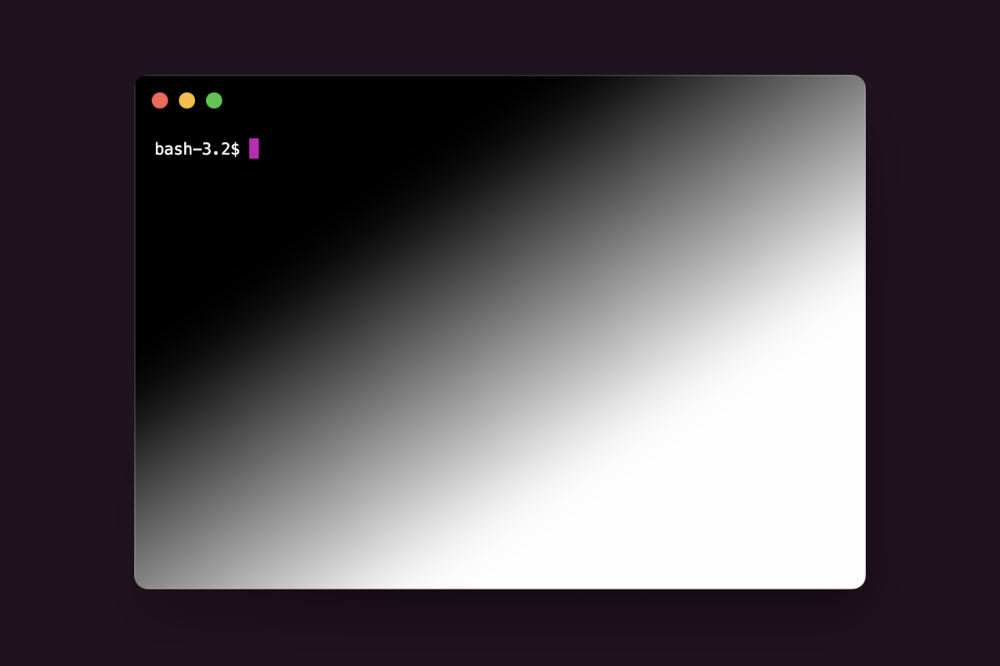

# System Theme Hyper Plugin

This plugin allows you to change the [Hyper](https://hyper.is) terminal emulator theme based on the
system theme. When the system theme changes, the window gets reloaded and the new theme is applied.



## Installation

Add `hyper-system-theme-plugin` to the plugins list in your `~/.hyper.js` configuration file.

```javascript
module.exports = {
  ...
  plugins: ['hyper-system-theme-plugin'],
  ...
};
```

## Usage

The plugin will expose two new configuration options in your `~/.hyper.js` configuration file:

- `lightThemeOverrides`: an object containing the config overrides for the light theme
- `darkThemeOverrides`: an object containing the config overrides for the dark theme

The keys in the `lightThemeOverrides` and `darkThemeOverrides` objects will override the default
Hyper configuration options. 

### Example

```javascript
module.exports = {
  ...
  lightThemeOverrides: {
    backgroundColor: '#fff',
    foregroundColor: '#000',
    cursorColor: '#000',
    borderColor: '#fff',
  },
  darkThemeOverrides: {
    backgroundColor: '#000',
    foregroundColor: '#fff',
    cursorColor: '#fff',
    borderColor: '#000',
  },
  ...
};
```

## Contributing

If you have any bugs, feature requests, or questions, please open an issue on the GitHub repository.
Pull requests are welcome, especially if you can figure out a way to reload the theme without
reloading the window :).

## License

This project is licensed under the MIT License - see the [LICENSE](LICENSE) file for details.
